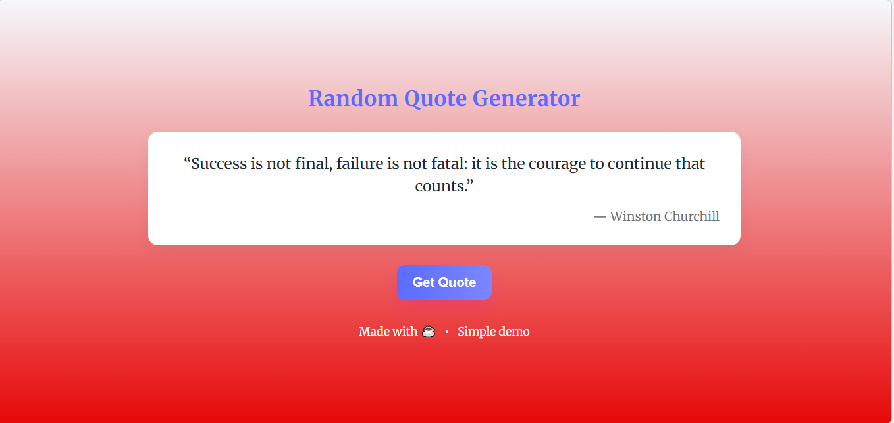

 ⚡ **Random Quote Generator**
 
 This is a **simple web application** that displays a random inspirational quote when the user clicks a button. The project is built using **HTML, CSS, and JavaScript**, making it lightweight and easy to run in any modern browser.  

It is designed as a beginner-friendly project and is perfect for practicing basic **web development skills** like DOM manipulation, event handling, and styling.

🚀 **Demo**

 **Features**
- Displays a random quote from a predefined list
- Simple and responsive design
- Button to generate a new quote with every click
- Easily customizable (add your own quotes, change styles)

**How to Run**
1. Clone the repository or download the files.
2. Open `index.html` in any web browser.
3. Click the **"Get Quote"** button to see a random quote.

**Technologies Used**
- HTML
- CSS
- JavaScript

**Author**
- **Roji mijar**
- GitHub: [Rojimijar1](https://github.com/Rojimijar1)
